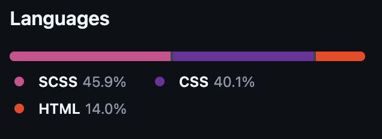
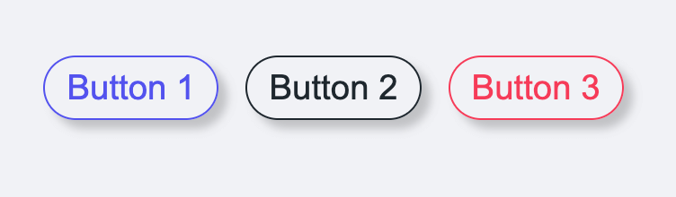
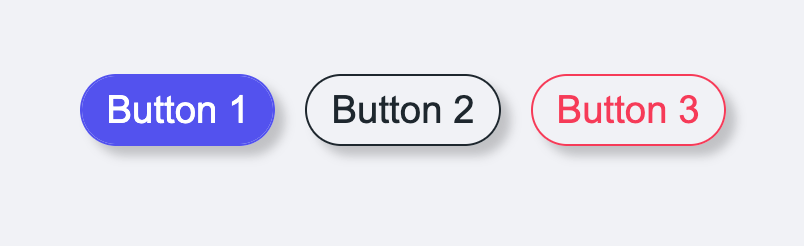
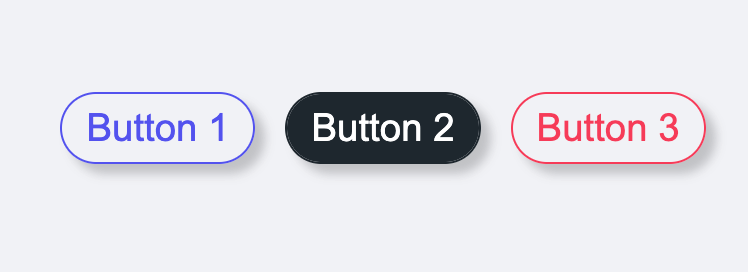
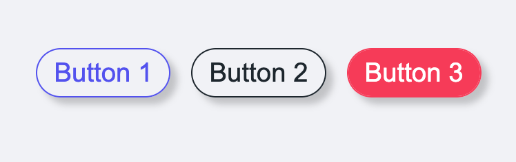

# SCSS-Button-Hover-Effect

## Languages used:

## Showcase:
#### Normal State

#### On Hover 1

#### On Hover 2

#### On Hover 3

To view and test the live example please click (here)[https://andrewh1188.github.io/SCSS-Button-Hover-Effect/]